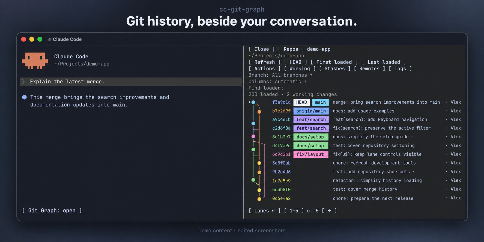
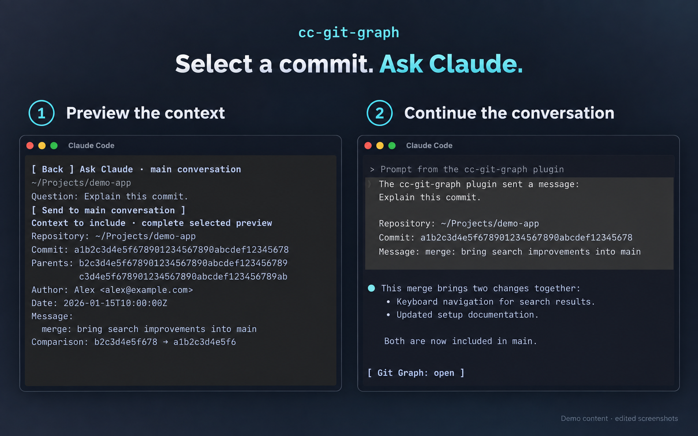

# cc-git-graph

**A colourful Git graph inside your Claude Code conversation.**

Browse commits, inspect changes and switch repositories without leaving the terminal. Run Claude in your orchestration repo and use Git Graph to explore the repositories where the work happens.

**Experimental · 0.1.4 candidate · macOS · tested on Claude Code 2.1.272**



*Illustrations adapted from real screenshots. Repository details and conversation text have been replaced with fictional demo content.*

## Features

- Twelve graph colours, matching commit hashes, and filled branch, remote, tag and HEAD badges. Lane controls stay fixed at the bottom of the graph while you scroll. Click the range (for example **1–8**) to choose **Auto**, **All**, or a custom maximum. Press Enter or Apply to save; Cancel keeps the current setting. The choice is remembered per repository. More lanes widen the graph gutter and shorten commit details. If the pane is too narrow, a fit message explains the limit; arrows reach the remaining lanes, and widening the pane restores the requested count.
- A **Git Graph** button above the prompt and `/git-graph` to open or close the panel. It starts closed.
- Configurable repository buttons based on the session's working directory; current-repository fallback when no map matches.
- Branch filtering, paged history, loaded-history search and bounded older-history search. History loads automatically as unfinished connections approach the visible area, in 200-commit pages without resetting your position. Failed reads pause for an explicit retry.
- Commit and merge-parent details, file diffs, working changes, tags, stashes and comparisons.
- Explicit Git actions with a target/effect preview and confirmation.
- **Ask Claude** to preview and send selected context to the main conversation.

Browsing does not submit model prompts. Git actions can change repositories; review their previews. Ask Claude submits only when you press Send.

## From a commit to a conversation

Select a commit, choose **Ask Claude**, and review the context before sending it. The selected Git context goes to your main conversation with your question.



## Install

Install from the public GitHub marketplace:

```sh
claude plugin marketplace add tomc98/cc-git-graph --scope user
claude plugin install cc-git-graph@cc-git-graph --scope user
```

Enable function hooks in your Claude profile's `settings.json`, **merging this entry into its existing `env` object**:

```json
{
  "env": {
    "CLAUDE_CODE_ENABLE_FUNCTION_HOOKS": "1"
  }
}
```

Restart Claude, then click **Git Graph** or run `/git-graph`. User-scope installation loads it across projects in that profile. A separate `CLAUDE_CONFIG_DIR` needs its own installation and flag.

Requires macOS, Git, `/usr/bin/python3` and `/usr/bin/pbcopy`. Node is needed only for development and packaging. See [installation, updates and removal](docs/INSTALL.md).

## Show the repositories you actually work on

Save this as `~/.claude/cc-git-graph.json` (or inside your custom `CLAUDE_CONFIG_DIR`), replacing the example paths:

```json
{
  "version": 1,
  "repositoryMaps": [
    {
      "whenPath": "~/Projects/control",
      "includeSubdirectories": true,
      "defaultRepository": "monorepo",
      "repositories": [
        { "id": "monorepo", "label": "Monorepo", "path": "~/Projects/monorepo" },
        { "id": "control", "label": "Control", "path": "~/Projects/control" }
      ]
    }
  ]
}
```

Sessions in `~/Projects/control` get **Monorepo** and **Control** buttons, initially showing Monorepo. Switching the graph's repository does not change the conversation's working directory. Without a matching map, it shows the current repository.

The most specific matching path wins. Paths accept an absolute path or `~/`; they do not expand `$HOME` or globs. Reopen the panel or press Refresh after editing the map. See the [complete example](examples/cc-git-graph.example.json).

## Compatibility and limitations

Function hooks are an early-access Claude API. Newer Claude builds require fresh verification; a larger version number alone does not establish compatibility.

- Wide fullscreen terminals use a side pane; narrower terminals use an inline pane. Claude controls the split size.
- This extends the conversation UI. The separate `claude agents` overview is unsupported.
- On the tested build, built-in Diff covers the graph until Diff closes.
- Full keyboard coverage, non-fullscreen mouse interaction and several background/agent handoff paths remain unverified.
- Linux and Windows are not supported by this release candidate.

See the [support matrix](docs/COMPATIBILITY.md) and [test coverage](docs/QA.md).

## Keyboard

Use **Ctrl+X, then Tab** to cycle host focus between the composer, plugin controls and pane. **Tab / Shift+Tab** move between controls; **Enter** activates the focused button. Click a commit's subject to inspect it. Confirm that an input has focus before typing.

## Development

See [CONTRIBUTING.md](CONTRIBUTING.md) for reproducible checks and native host testing, and [release preparation](docs/RELEASING.md) for packaging and versioning.

## Licence and inspiration

[MIT](LICENSE) for this project's original code. Inspired by the history-browsing experience of [VS Code Git Graph](https://github.com/mhutchie/vscode-git-graph); this is an independent terminal implementation, with no upstream renderer, source files or assets bundled. See [provenance](docs/PROVENANCE.md).

Not an official Anthropic product or affiliated with VS Code Git Graph.
