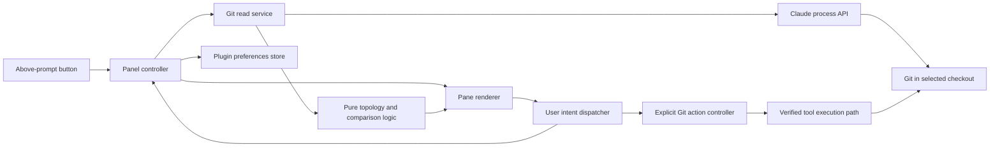

# cc-git-graph — product and technical specification

> Release note: this document describes the original milestones and full-product acceptance target. The experimental 0.1.0 candidate includes browsing, comparisons, explicit Git actions and Ask Claude; it is not the earlier read-only milestone or a completed 1.0. See [compatibility](docs/COMPATIBILITY.md) and [QA status](docs/QA.md) for current limits.

**Date:** 15 September 2026  
**Status:** historical full-product specification; experimental 0.1.0 preparation  
**Owner:** Thomas Csere  
**Project:** `./`  
**Initial runtime:** Claude Code 2.1.272, macOS terminal, function hooks enabled

## 1. Outcome

Build a Git history browser inside Claude Code's conversation page. A small **Git Graph** button above the input prompt is its only visible presence when closed. Clicking it opens a panel alongside the conversation containing a branch graph, commit history, filters, and commit/file details. Clicking it again closes the panel and restores the conversation's space.

The graph must be useful during an active Claude conversation: browsing, selecting, searching, and inspecting changes must not submit prompts, consume model tokens, or block the conversation. Git operations run only in response to a deliberate action in the panel.

The reference is the interaction model of VS Code Git Graph: inspect history visually, select a commit, inspect its changes, and act on a specific Git object. The result should feel native to Claude's terminal interface.

### Success in one scenario

A user launches `claude` inside a checkout, continues chatting, clicks **Git Graph**, sees the current branch and merge history, selects a commit, reads a changed file's diff, and closes the panel. His draft prompt is preserved and the graph has made no repository changes. He can reopen it at the same selection during that session.

For orchestration, A user launches in `~/Projects/control` and configures that path to offer **Monorepo** and **Control** buttons. The graph initially shows the configured default, Monorepo, and either button switches the displayed repository without moving the conversation. Outside a matching configuration, it shows the repository containing the session's current working directory.

## 2. Scope and release boundaries

The complete product includes the browsing experience and explicit Git operations. A read-only prototype is a milestone, not completion of the full project.

| Area | First browsing release, 0.1 | Full planned release, 1.0 |
| --- | --- | --- |
| Panel | Toggle button, slash command, close, focus, dock/inline layouts | Same behavior, validated alongside other panes and plugins |
| History | Coloured topology, local/remote refs, tags, HEAD, paging | Same, with saved display/filter preferences |
| Inspection | Commit details, parent selection, file list, unified diffs | Two-commit comparison and working-tree comparisons |
| Navigation | Path-to-repository mappings, labelled repo buttons, current-repo fallback, branch filter, loaded-history search, go to HEAD | Additional repository/worktree picker, bounded older-history search |
| Working state | Staged, unstaged, untracked and conflict indicators | Stash inspection and explicit stash operations |
| Git actions | Read-only | Branch, tag, commit, stash and remote actions described in section 10 |
| Claude integration | Coexists with chat; no automatic messages | Explicit “Ask Claude” with a preview of the selected context |
| Quality | Tested local prototype and first usable browser | All mandatory acceptance criteria in PLAN.md passed |

### Deferred beyond 1.0

- Editing the separate `claude agents` overview page.
- A pixel-identical reproduction of VS Code, embedding its webview, or an Electron/browser sidecar.
- Desktop/mobile certification; the first release targets the terminal surface.
- Full graphical conflict resolution, interactive rebase editing, bisect, submodule administration, and Git LFS management.
- Arbitrary shell commands, a general-purpose Git terminal, staging individual hunks, or a commit-message editor.
- Avatar downloads, issue-tracker configuration, PR creation templates, and persistent code-review checklists.
- Changing Claude's global layout, replacing its built-in `/diff`, or forcing an exact 50/50 split.

## 3. Evidence, constraints and unresolved points

These are implementation boundaries, not claims that the proposed mod already works.

### Verified source contract

The [declarations shipped in the 2.1.272 repository tag](https://github.com/anthropics/claude-code/blob/v2.1.272/mods/types/claude-code.d.ts) expose `AbovePrompt`, `Pane`, interactive elements, host process calls and plugin storage. Their header still says they were generated by **2.1.271**. Regenerate through `/plugin-types` on the running build during the first implementation milestone and record any differences.

| Capability | Design consequence |
| --- | --- |
| `AbovePrompt` is a terminal render site | Put the launcher directly above the composer, not in Claude's fixed footer |
| `Button`, `Input`, `Select`, `ui.press/input/select` | Use actual controls with mouse and keyboard interaction |
| `$.ui.open/close`, `Pane`, host scroll/focus state | Open and close one named pane; cooperate with the host |
| Fullscreen docking starts at 110 terminal columns | Wide fullscreen uses a side panel; narrow/main-screen layouts use inline presentation |
| Pane placement and body dimensions are read-only | Adapt content to the space Claude grants; do not promise a split ratio |
| Multiple panes share a tabbed region | Git Graph may be a tab beside Diff rather than a second simultaneous side panel |
| `Client` has pointer/key events | Optional richer graph hit-testing after an interactive spike |
| Runtime has no Node or DOM globals | Use TypeScript modules and host APIs; no VS Code/browser runtime |
| `$.process.run` is one-shot, has a timeout and bounded text output | Use short, bounded reads; test truncation and stale results |
| The process API disables repository Git hooks | Do not use it as the unexamined transport for write operations |
| `SiteView.agentId` identifies the displayed transcript | It does not by itself identify that agent's working directory |

The [mods README](https://github.com/anthropics/claude-code/blob/v2.1.272/mods/README.md) labels function hooks early access. Support is pinned to builds we actually test; a higher version number alone is not a compatibility guarantee.

### Must be proved in Phase 0

1. The button opens a docked pane through a real mouse click and toggles it shut.
2. Composer focus, a nonempty draft and streaming output survive opening/closing.
3. How host scrolling interacts with a partially rendered history list, resizing, and multiple panes.
4. Whether another pane becoming selected can be detected well enough to pause polling.
5. Actual runtime declarations, render budgets, output limits/truncation behavior, and plugin unload cleanup.
6. Whether a person-triggered `$.tool.call` can execute a Git write with ordinary repository hooks and host permissions, including while a model turn is active.

If item 6 fails, retain the browsing release and document the exact limitation. Do not silently substitute a hook-bypassing write transport or claim full 1.0 completion.

## 4. Interface

### Closed

Only a one-line **[ Git Graph ]** control is visible above the prompt. Compose with any existing `AbovePrompt` content instead of replacing it. Yield to the host survey when `hasSurvey` is true. No spinner, repository scans, graph data fetching, timers or network access while closed.

The optional command `/git-graph` toggles the same pane; `/git-graph open`, `close`, `refresh` and `head` make the basic actions explicit. Register the command as immediate so opening the browser is not queued behind a model turn. Unknown arguments show usage. Opening is idempotent.

### Open, docked

Conceptual arrangement; the widths are chosen by Claude:

```text
Conversation                         │ Git Graph                       [×]
                                     │ repo / checkout       [Repository]
                                     │ [Monorepo] [Control]
Claude continues responding…         │ [Branches ▾] [Find…] [HEAD] [↻]
                                     │ ● │  fix: use active checkout   main
                                     │ │ ●  add history paging         topic
                                     │ ●─╯  merge topic                origin/main
                                     │ ●    introduce graph panel
                                     │                      [Load older]
                                     │ ── selected commit ───────────────
                                     │ hash · author · timestamp
                                     │ message / parents / refs
                                     │ [Files] [Compare] [Actions] [Ask]
                                     │ path/to/file.ts       +14 -3
                                     │ unified diff / detail view
[ Git Graph: open ]                   │
> existing draft remains here        │
```

At limited panel height, show the graph or a commit/file detail screen within the same pane, with **Back** preserving the graph position. Do not squeeze several unusable nested scroll areas into a small terminal. At larger sizes, an internal details section can share the pane with the graph. This internal arrangement never changes the outer conversation split.

The repository-button row appears when the current path has a configured map. Buttons use the configured labels, preserve their order and visibly mark the selected repo. They are directly clickable and keyboard accessible; switching the two mapped repositories must not require opening a dropdown. Wrap/scroll the row at narrow widths so every option remains reachable. These controls live inside the opened graph pane; when closed, only the original Git Graph launcher remains visible. With no matching map, the header identifies the current repository and no extra configured-repository row is needed.

### Inline and narrow layouts

The same pane appears above the composer when docking is unavailable. Use a compact history list and drill-down details. Prioritize graph, subject and ref/HEAD labels; hide author/date columns as space shrinks. A minimum-width case shows a readable compact list or an instruction to widen the terminal, never corrupted graph edges. The toggle and close controls remain reachable.

Use the dimensions provided by each site, not the overall terminal width, for clipping. Text must be measured in terminal display cells; test emoji, combining marks and wide characters.

### Interaction rules

- Click a commit row to select it. Show full metadata without running a Git mutation.
- Up/Down and Page Up/Page Down navigate when the graph owns focus; Enter opens details.
- Use an explicit **Compare from** action and then select the second commit. Modified clicks may be added after testing; they are not the only way to compare.
- Tab/Shift+Tab traverse native controls. Escape follows Claude's focus hand-back behavior; a visible Close button and the launcher always close the pane. Do not intercept Escape globally.
- Search typing stays inside its input and does not enter the conversation composer.
- Refresh and go-to-HEAD have visible buttons. Extra shortcuts are scoped to focused graph controls and must not shadow chat shortcuts.
- An **Actions** menu is the primary discoverable route to operations. Right-click is optional, contingent on terminal support.
- Colour distinguishes graph lanes but never carries meaning alone. Use node/edge shapes, selected-row markers and textual ref labels.
- No forced focus on automatic redraw. Opening cannot steal an existing draft or an active dialog.

## 5. History and repository behavior

### Repository identity

On first open, resolve the session's working directory using `$.session.cwd()`, resolve its path map, then use Git's own repository discovery on the chosen target or fallback directory. A mapped orchestration directory must not be rejected just because it is outside Git. Identify the selected checkout by its canonical working-tree root and Git directory. Record the common Git directory separately: multiple linked worktrees share objects but have different HEAD, index and working-tree state.

Initial selection is resolved from the optional path map below, falling back to the checkout containing the conversation's cwd. The header always shows which checkout is displayed, and distinguishes the session directory from the graph target when they differ. A user-selected repository/worktree changes only the graph's target, never Claude's cwd.

The later repository picker includes the mapped choices, discovered checkout and linked worktrees, plus repositories explicitly added through a path input. It supplements the direct mapped-repository buttons. Do not recursively scan the user's filesystem. Treat submodules as separate repositories when selected. Bare repositories can show history but disable operations requiring a working tree.

An agent transcript switch does not automatically retarget Git operations. The API's agent listing lacks a dependable cwd field. Keep the checkout explicit; only add automatic agent-to-checkout mapping after a separate proven source exists.

### Optional path-to-repositories configuration

This is required for the first browsing release. The map associates a **session directory** with an ordered list of **repositories the graph can display**. It does not require the session to run inside the repository being edited, and the mapping directory itself need not be a Git repository.

Configuration file: `cc-git-graph.json` in the active Claude config directory, normally `~/.claude/cc-git-graph.json`, or inside a custom `CLAUDE_CONFIG_DIR`. Derive the directory from the runtime/profile environment. This file is optional, manually editable JSON; installation does not replace existing maps.

```json
{
  "version": 1,
  "repositoryMaps": [
    {
      "whenPath": "~/Projects/control",
      "includeSubdirectories": true,
      "defaultRepository": "monorepo",
      "repositories": [
        {
          "id": "monorepo",
          "label": "Monorepo",
          "path": "~/Projects/monorepo"
        },
        {
          "id": "dev-control",
          "label": "Control",
          "path": "~/Projects/control"
        }
      ]
    }
  ]
}
```

The two example repository roots were verified on disk. A copy is in [examples/cc-git-graph.example.json](examples/cc-git-graph.example.json). Any number of maps may be configured for other orchestration directories; this behavior is not project-specific.

#### Schema and matching

- `version` is required and must be supported. An absent file, empty object or empty `repositoryMaps` means no mappings and uses normal current-repo discovery.
- `whenPath` is an absolute path or begins with `~/`. Expand only that home prefix; never evaluate shell expressions. The same rule applies to repository `path` values. Relative paths, environment substitutions and glob patterns are outside the initial schema.
- Match the working directory reported by the session API: initially the launch directory, subsequently the host's actual cwd. Do not infer it from a Bash command's arguments, the last file Claude edited or an agent's title.
- Normalize trailing separators, `.`/`..` and existing symlink paths before comparing. `includeSubdirectories` defaults to true; false means exact-path only. Descendant matching uses directory boundaries, so `Control-backup` does not match `Control`.
- If several maps match, use the longest matching directory path. If normalized paths tie, the earlier entry wins and validation reports the duplicate. Do not merge repositories from multiple matching maps.
- Each repository has a unique nonempty `id`, a nonempty button `label` and a `path`. Resolve the selected target through Git discovery; a path inside a checkout is allowed. Deduplicate entries resolving to the same checkout, retaining the first entry's label and order. Linked worktrees remain distinct checkouts.
- `defaultRepository` optionally names a listed ID. For a fresh context select that usable entry; otherwise select the session's current repository if it is among the usable choices; otherwise select the first usable entry in configured order. A default that is missing/unavailable is reported without making the whole graph unusable.
- A selected map with an empty/missing repository list, invalid shape, or no usable targets falls back to the session's current repository. It does not unexpectedly inherit a broader map. Invalid/unavailable targets are reported within the pane; unavailable configured buttons may remain disabled so the cause is visible. A malformed file or unsupported version also falls back, with a configuration message.
- If fallback discovery finds no repository, show the existing “not a repository” state. Do not initialize a repo or choose an unrelated directory.

#### Switching, reload and persistence

Only the selected repository loads history or receives Git actions. The map may be read and configured targets validated when opening the pane, but inactive repositories do not get history scans, polling or background fetches. Keep the visible checkout identity tied to every read, diff, comparison and action.

Within the same matched context, remember the chosen button and each checkout's selection/scroll in memory when toggling between repos or reopening the panel. On switching targets, discard pending action forms and comparison anchors, and reject late reads from the old target. Prevent switching while a mutation is executing so its result cannot appear under another repository's header.

Re-resolve configuration on panel open, explicit Refresh and an observed host cwd change while open. Moving within the same matched map preserves a still-valid selection. Entering another map or an unmatched path resets selection according to that context; an old mapped selection must not override current-repo fallback. A configuration edit that removes the current choice similarly resets it. Loading a replacement target never leaves the previous repo's graph displayed under the new label.

If a cwd/config change arrives during a running mutation, keep its original checkout visibly bound until reconciliation finishes, then apply the new context. Disable new actions during that transition; a config refresh cannot redirect an in-flight operation or its result.

In the later manual picker, an explicit temporary pin is visibly labelled and lasts only in the current session context. **Follow conversation** clears that pin and reapplies the map for the current cwd, or current-repo fallback. New sessions start from the configuration/default rules, not a repository remembered from an unrelated session. Persistent configuration is the map file; display preferences remain scoped to checkout identity.

#### Required examples

| Session path / config | Repo choices and initial display |
| --- | --- |
| Control with the example map | Buttons: Monorepo, Control; starts on Monorepo |
| A subdirectory inside Control | Same two buttons when `includeSubdirectories` is true |
| Control with no file or an empty map | Its own repository only |
| The sibling monorepo, with only the example map configured | Monorepo through current-repo fallback; the sibling map does not match |
| Another unrelated project | That project's repository through fallback |
| An orchestration directory outside Git, mapped to two valid repos | Both configured buttons still work |
| A more-specific mapped subdirectory | Only that map's ordered repositories |

Configured paths expose display choices; they never change where Claude works or authorize a Git mutation.

### History data

- Show topological ancestry, commit subject, abbreviated object ID, refs, HEAD and optional author/date.
- Default history roots: local and remote-tracking branches, tags and detached HEAD, if present. Stashes are displayed separately so their internal commit topology does not distort ordinary history.
- Start with 200 commits. Load another 200 on demand. Cap the active snapshot at 5,000 commits initially, with an explicit message when reached and filtering as the next action.
- Resolve selected roots to immutable object IDs at refresh time. Continue paging that snapshot; moving refs must not cause duplicate or skipped rows. Show **New history available** and rebuild only on refresh.
- Keep full IDs internally and do not hard-code SHA-1's length. Short IDs are display values, never operation targets.
- Search loaded history immediately by subject, author, ID and ref label. Display “searching loaded history” clearly. An explicit older-history search is bounded and reports its coverage; it does not quietly reorder or falsify the graph.
- A branch filter changes root selection. Preserve real parent information and mark ancestry that continues beyond the loaded/filtered boundary.

### Topology algorithm

Implement an original lane assignment function independent of UI and process APIs. Input: ordered commits with full parent IDs. Output: node lane, lane colour identity, and edge segments to the next row. Preserve the first-parent continuation where possible; allocate lanes for additional parents and coalesce a lane only when it actually reaches the same ancestor.

The layout must distinguish linear history, branches, merges, octopus merges, disconnected roots, shallow boundaries and parents beyond the page. On pagination, the existing rows keep their assignments. On a complete refresh, deterministic input must produce deterministic output. If too many lanes fit, show a marked offscreen continuation and a lane-window control; do not make hidden edges appear to terminate or merge.

Use a twelve-colour lane palette with colour identities separate from physical lane slots. Render node and connector cells individually so a passing lane keeps its own colour on another lane's row. Reusing an empty slot for a disconnected path allocates a new colour identity. First-parent continuations retain their colour where the existing parent layout permits it; crossing cells prioritise the continuing vertical path. Display filled HEAD/local-branch/remote/tag badges, a distinct HEAD node and the selected-row marker. At pane widths below 64 columns, ref badges can use the connector row to leave room for the commit subject; boundary/search warnings retain priority.

Start with coloured terminal text and native selectable rows. Use `Client`/`Raster` only where measured interaction or rendering performance warrants it. Keep topology separate from glyph selection so the renderer can change without rewriting Git logic.

## 6. Details, diffs and comparisons

Commit details include full hash, author/committer identities and times, complete message on demand, parent links and refs. Clicking a file opens a unified diff, using native `Code` rendering where its diff support is sufficient.

Every comparison names both endpoints:

| Selection | Meaning |
| --- | --- |
| Ordinary commit | Selected commit against its parent |
| Root commit | Its tree against the repository's empty tree |
| Merge commit | Default first parent, with an explicit parent selector |
| Compare A to B | Tree at A versus tree at B; not implicitly merge-base semantics |
| Staged | HEAD versus index; supports an unborn HEAD |
| Unstaged | Index versus working tree |
| Working tree vs commit | Selected commit versus current tracked working-tree content |
| Untracked | Separate file preview; never pretend it belongs to a committed diff |

File lists use machine-readable status and rename records; file paths with tabs, newlines, spaces or Unicode must remain addressable. Display escaped control characters while retaining the original value for Git. Binary files show metadata and a binary indication. Symlinks show link changes, submodules show their object changes, and conflicts have a distinct unresolved state.

Fetch file content only when selected. Set a product preview limit of 256 KiB / 2,000 lines per file, with a visible limit indication. The host's actual output cap must be measured; a smaller cap wins. Partial output must never be presented as a complete patch. External diff and textconv helpers are disabled for read previews. Huge commits load file lists and individual patches in bounded batches.

If the host provides no dependable truncation signal, the read adapter must establish completeness through an independently verifiable bounded protocol before labelling a patch complete. Until that protocol is proved, label it a potentially incomplete preview and do not offer patch-based write actions. A trailing newline alone is not evidence that output was complete.

Comparisons of immutable objects can be cached. Working-tree/index results are generation-scoped and must be refreshed after a change. A selection remains attached to its object ID, not its previous row number.

## 7. Runtime architecture

One local Claude Code plugin, no daemon or browser server. Build tools may use Node; the hooks runtime may not.



### Proposed files

```text
.claude-plugin/plugin.json
hooks/hooks.json
hooks/register.ts
hooks/controller.ts
hooks/state.ts
hooks/host.ts
hooks/config/{repository-maps,resolve-context}.ts
hooks/git/{repository,history,refs,status,diff,operations,parse}.ts
hooks/graph/{layout,lanes,cells}.ts
hooks/ui/{launcher,pane,history,details,files,actions}.tsx
hooks/ui/graph.client.tsx                 # only if the spike justifies Client
hooks/preferences.ts
tests/                                  # Claude's mod test runner
integration/                            # disposable real-Git fixtures
scripts/{make-fixtures,verify}.mjs
docs/{COMPATIBILITY,QA}.md
examples/cc-git-graph.example.json
.claude/types/                          # generated API declarations
package.json
tsconfig.json
README.md
SPEC.md
PLAN.md
```

This is a proposed layout, not files implemented by this planning task. Avoid additional layers until the feature they support exists.

### Host adapter

Keep early-access API calls in a small adapter: pane lifecycle, render invalidation, commands, timers, storage, config-file reading, cwd, read execution and action execution. Parse and resolve repository maps separately from Git history and rendering. The rest of the code operates on plain typed data. Do not recreate the entire Claude API as an abstraction.

Register render handlers using filters and pass through unmatched events. Use a distinct pane ID such as `cc-git-graph` and stable element keys based on IDs, not commit subjects. Do not replace engine UI elements globally or add policy through `engine.create`.

### State

Separate:

- **UI state:** open/closed, view mode, selection, comparison anchor, search, scroll anchor and focus intent.
- **Repository context:** current session cwd, matched map, ordered button choices, selected ID, explicit pin if any and configuration revision.
- **Repository state:** selected checkout, HEAD, refs, working-state summary and snapshot generation; cached separately by checkout identity.
- **History state:** root IDs, page coverage, commits, lanes and loading/error indicators.
- **Action state:** pending intent, explicit targets, execution state and post-operation reconciliation.
- **Preferences:** columns and branch filter scoped by checkout identity; repository maps live in the optional profile configuration file. Active repository selection is session/context-scoped, not a global persisted override.

An open/close toggle must not persist “open” across sessions. Every new conversation starts closed. Keep reopen selection/scroll in memory for the current session. Use versioned storage keys and a small bounded preference payload, never commit bodies or complete history in persistent storage.

### Lifecycle and concurrency

Closed → opening → ready/error → closed. Details, comparison and action forms are subviews of the open pane. Close cancels scheduled polling and invalidates the current generation. Already-running reads may finish but cannot update a later generation or a different checkout.

Process calls do not expose a general cancellation handle. Use short timeouts and discard stale responses instead of claiming close kills an in-flight child. Allow at most two read processes per plugin instance and one mutation per selected checkout in that instance. Plugin locks cannot exclude an external shell or another Claude session; re-read Git state before and after writes.

While open, coalesce relevant tool completions and cwd/file-change notifications into one refresh. Re-resolve the path map when the session cwd changes, and refresh only the selected repository. Use a 500 ms debounce and a 3-second lightweight visible-panel poll to detect external changes. On repeated slow reads, back off. If active-pane visibility cannot be detected, bound polling to the open pane and document that it can continue while its tab is hidden. Closing always stops it.

Keep the last good view while refreshing. On failure, show its stale status and retry action. If the repository itself changes, clear old results immediately so they cannot be mistaken for the new checkout.

## 8. Git reads and parsing

Use explicit argv arrays through the host's process API, with a pinned `cwd`, timeouts, no pager and machine-oriented formats. Display strings never become shell source. Suggested command families, to be finalized against fixtures:

| Need | Git interface |
| --- | --- |
| Discover checkout | `rev-parse` for root/Git/common directories, bare/shallow state and object format |
| Enumerate refs | `for-each-ref` with explicit fields |
| Ordered IDs and ancestry | `rev-list` / `log` with topological order and resolved roots |
| Metadata | Explicit pretty-format fields in bounded batches |
| Dirty state | `status --porcelain=v2 -z` |
| Linked worktrees | `worktree list --porcelain -z`, with capability handling |
| File changes | `diff-tree` / `diff` with raw or name-status NUL records |
| Patch previews | `diff --no-ext-diff --no-textconv`, explicit endpoints and literal paths |
| Stashes | `stash list` with explicit fields and resolved object IDs |

Resolve user selections to full object IDs before reading or acting. Use Git's own ref validation for new names. Pass path arguments after `--` and use literal pathspec behavior for actual filenames. Use a proper shell-quoting routine only for the write transport that requires shell text.

Parse records structurally. Avoid whitespace splitting, parsing coloured `git log --graph`, or splitting on a sentinel that can appear in a commit message. Fetch known batches of IDs and require metadata records to match them; malformed or incomplete output is an error, not a successful short page. Account for deleted refs and unavailable objects during paging.

Read environments should use `GIT_OPTIONAL_LOCKS=0`, disable interactive Git prompting, and avoid optional network/lazy-fetch behavior where supported. A missing promisor object is shown as unavailable; browsing should not initiate a hidden fetch. Do not alter repository configuration to achieve these settings.

The history/cache key includes repository identity, selected root IDs, sort/filter options and object format. The working-state key also includes a refresh generation. Bound in-memory data to the loaded page limit and a 32 MiB detail cache budget. On context resolution, release repository views that are no longer among its available choices; retain mapped choices and the active explicit pin. This prevents old contexts from accumulating complete histories throughout a long session.

## 9. Performance and failure behavior

These are engineering targets, not measured results:

- Closed panel: no recurring Git processes or network calls after work already in flight settles.
- Open/close feedback within 100 ms; show a loading state rather than waiting for Git.
- First 200 rows within 1 second in the representative local fixture, warm; record cold timing separately.
- Selection using cached data within 100 ms. Scrolling must not wait for Git.
- Render only the needed rows plus a small overscan where the host's scrolling contract allows it. Prove that contract before choosing list virtualization; a clipped slice must not break the scrollbar's logical range.
- Throttle redraws and reuse topology between refreshes. Target a 30 ms visible-window render budget, then measure on a real terminal.
- Read timeout defaults: 5 seconds for light discovery/status, 15 seconds for bounded history/diff queries. Fail with an inline retry rather than freezing the chat.

Required states: not a repository, no commits yet, bare repository, detached HEAD, shallow/partial history, missing Git, missing object, locked index, removed worktree, conflicting operation, permission denial, timed-out read, unsupported mod API, and truncated output. Error text must say what failed and what the user can do next. Preserve useful readable results when possible.

## 10. Explicit Git operations

### Execution contract

Actions operate on the visibly selected checkout and full object IDs. Opening an action form performs no mutation. The form displays the checkout, selected object/ref, target, and concise effect; its action button is the execution step. Destructive or remote-changing actions require explicit confirmation of their target/effect in that form. Viewing history and local read refreshes require none.

Do not infer execution authorization from merely opening the graph, selecting a row, or asking Claude to explain a change. Host permission denials remain denials; the mod does not modify permission settings.

**Write transport is a required prototype gate.** The documented read process API disables Git hooks, which could skip repository workflows. Prefer a verified person-triggered host tool call that preserves normal hooks, signing and permissions. Do not add `--no-verify` or silently disable signing. If the call cannot run safely mid-turn, mark the action unavailable until the turn ends or queue only with explicit user understanding; browsing remains responsive.

### Action inventory

| Group | Planned 1.0 actions | Essential behavior |
| --- | --- | --- |
| Branches | Create, switch, rename, delete, merge, rebase onto selected commit/branch | Recognize branches checked out in another worktree; never force-switch or auto-stash |
| Commits | Checkout detached, cherry-pick, revert, reset current branch | Merge cherry-pick/revert requires parent choice; reset names soft/mixed/hard explicitly |
| Tags | Create lightweight/annotated, inspect, delete, push selected tag | Show exact tag/ref and remote; preserve configured signing behavior where applicable |
| Stashes | Create, inspect, apply, pop, drop, create branch from stash | Select by resolved stash identity; re-resolve index before destructive stash operations |
| Remotes | Fetch, pull, push, inspect/add/edit/remove remotes | Display named remote/refspec; pull strategy explicit; no automatic fetch on open |
| Worktree state | Discard selected tracked changes; clean selected untracked files | Enumerate affected paths first; refuse ambiguous broad deletion |

A normal branch delete uses Git's merged-branch check; a separately confirmed force-delete is a distinct action. Normal push never silently escalates to force. If force pushing is later exposed, it must be a distinct operation using an exact observed lease, with its own tests; it is not required for 1.0.

Before submitting a mutation, verify expected HEAD/ref, working-state prerequisites and worktree occupancy. If they changed since the form opened, refresh the form and require a new deliberate action. Do not modify an unrelated checkout to make an operation succeed.

Report running, succeeded, failed, conflict and outcome-unknown separately. A timeout or disconnected remote may leave a changed repository: reconcile state and do not retry automatically. If conflicts remain, expose the Git operation state and explicit Continue/Abort where supported, or a copyable next command. Never claim that abort undoes unrelated user edits.

### Clipboard and Claude context

Copy hash/ref/path is an explicit click, using a platform adapter. On macOS prefer `pbcopy` through the host with stdin; do not write unrequested clipboard content. Clipboard errors remain visible.

**Ask Claude** previews the selected commit metadata or bounded patch and a prompt before sending. It submits only after the user clicks Send. Clearly label which conversation receives it; if targeting an agent transcript cannot be proved, limit the action to the main conversation and say so in the control. Ordinary panel browsing submits nothing.

## 11. Packaging, compatibility and rollout

Use a Claude plugin manifest and `hooks/hooks.json` with a module entry. Generate declarations through the actual runtime's `/plugin-types` command and typecheck with a pinned TypeScript version. Avoid runtime dependencies unless needed; any bundled pure-code dependency must work without Node/DOM and have suitable terms for distribution.

During development, load by path in a fresh session:

```sh
CLAUDE_CODE_ENABLE_FUNCTION_HOOKS=1 claude --plugin-dir /absolute/path/to/cc-git-graph
```

Run native plugin tests from the checkout with `npm run test:mod`. See [installation](docs/INSTALL.md) for permanent user-scope installation and custom profiles.

Build/test scripts do not update Claude, rewrite shell launchers or install the plugin into a user profile. Updating the host and updating the plugin are separate operations. Track the Claude version, generated types, plugin version, terminal and layout in the compatibility matrix. Upgrade verification reruns native tests and a terminal walkthrough. No background service is installed.

## 12. Source reuse decision

Use the original Git Graph as a product reference, with original graph code, terminal rendering and assets. Its [license at the reviewed revision](https://github.com/mhutchie/vscode-git-graph/blob/d7f43f429a9e024e896bac9fc65fdc530935c812/LICENSE) expressly withholds permission to distribute derivative works. Do not copy its implementation or assets into this project under an assumed MIT license. Also review terms before reusing any Anthropic sample implementation; the plan needs API usage, not copied mod code.

The original project code is licensed under MIT. See LICENSE and docs/PROVENANCE.md for the dependency inventory and exclusions. Publishing a release is a separate maintainer action.

## 13. Evidence references

- [Claude Code 2.1.272 API declarations](https://github.com/anthropics/claude-code/blob/v2.1.272/mods/types/claude-code.d.ts): named interfaces and constraints above; header generated by 2.1.271.
- [Claude mods README](https://github.com/anthropics/claude-code/blob/v2.1.272/mods/README.md): module packaging, early access, test runner.
- [Built-in Diff mod](https://github.com/anthropics/claude-code/tree/v2.1.272/mods/diff): reference for the host's existing pane behavior, not proof of this proposed mod.
- [Claude plugin reference](https://code.claude.com/docs/en/plugins-reference): normal plugin packaging and lifecycle; function-hook details come from the versioned declarations.
- [Git Graph reference revision](https://github.com/mhutchie/vscode-git-graph/tree/d7f43f429a9e024e896bac9fc65fdc530935c812): reference product, package version 1.30.0 as observed; not a claim that its marketplace version was checked.
- [Git log](https://git-scm.com/docs/git-log), [Git diff](https://git-scm.com/docs/git-diff), [Git worktree](https://git-scm.com/docs/git-worktree): canonical Git behavior; use the installed Git version and fixtures to verify exact supported options.

For execution order, prototype gates and release acceptance, see [PLAN.md](PLAN.md).
